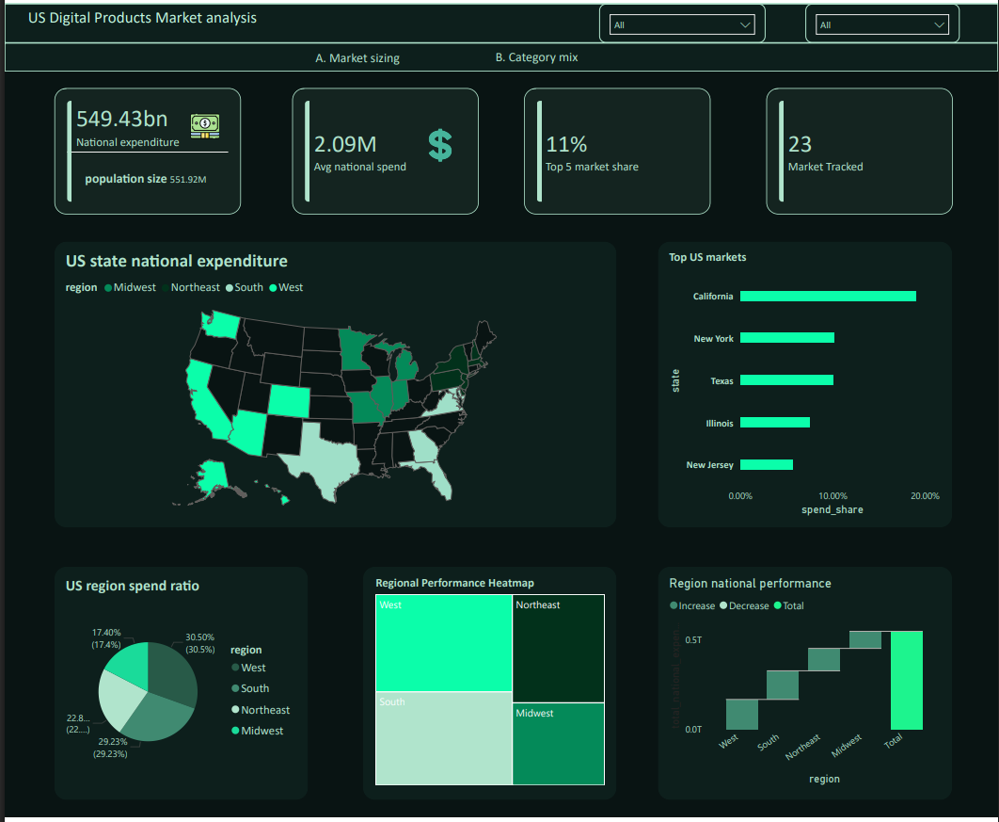
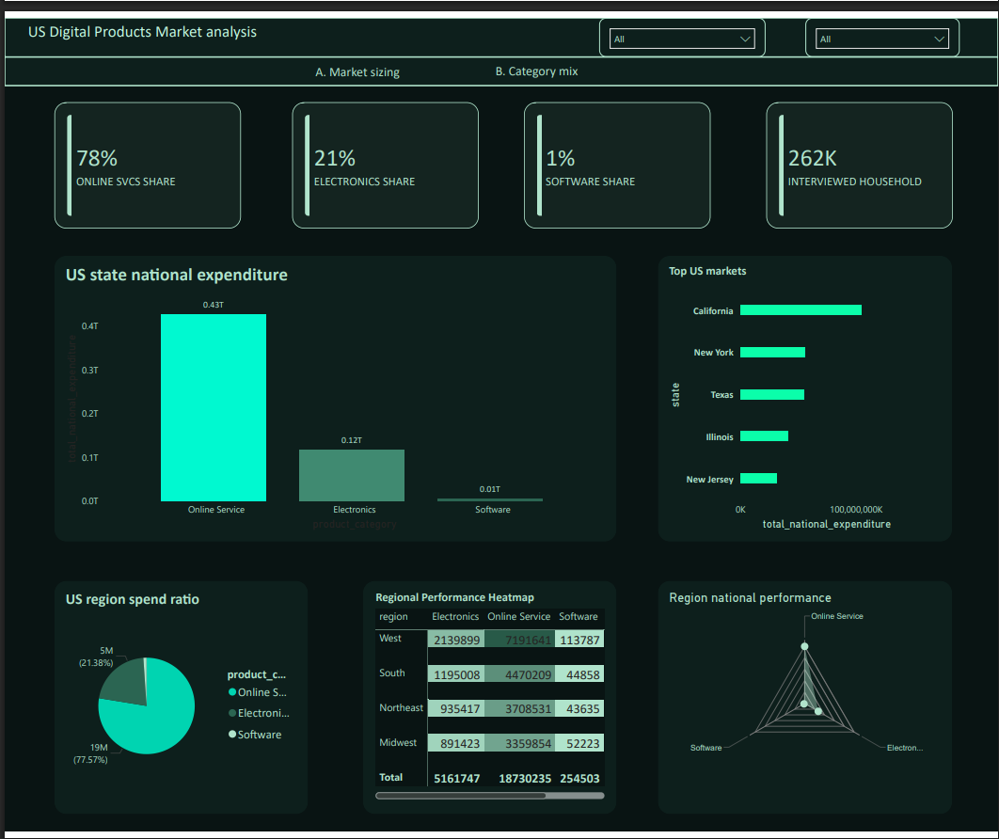

<!--
README (Hybrid Findings Report + GitHub)
Digital Product Insights (US) ? Version 1.0 | Date: February 24, 2026
-->

# ? US Digital Products Market Intelligence

### Turning 262K+ Household Records into Actionable Market Strategy

[](https://python.org)
[](https://pandas.pydata.org)
[](https://powerbi.microsoft.com)
[](https://scikit-learn.org)
[](https://www.bls.gov/cex/)

---

_A data-driven market analysis of US digital product spending ? electronics, software, and online services ? built on Bureau of Labor Statistics Consumer Expenditure microdata. This project identifies where demand lives, how it's shifting, and where a digital products company should place its next bet._

[Executive Summary](#-executive-summary) � [Key Findings](#-key-findings) � [Methodology](#-methodology) � [Dashboard](#-dashboard) � [ML Models](#-predictive-models--market-segmentation) � [Dataset](#-the-dataset)

</div>

---

## ? Executive Summary

The US digital products market ? spanning consumer electronics, software, and online services/subscriptions ? is a **$549.43 billion** weighted national expenditure landscape. But not all markets are created equal.

Using **262,467 household-level expenditure records** from the BLS Consumer Expenditure Interview Survey (PUMD), this project moves beyond gut instinct to answer the questions every growth team is asking: _Where should we invest next? What should we push where? And which markets are actually high-value versus just big?_

**The headline:** Online services dominate at **78% of total category spend**, yet the real strategic edge lies in identifying markets where per-household intensity diverges from raw volume ? and this project maps exactly that.

---

## ? Business Problem

A digital products company selling across the US through e-commerce and digital delivery is allocating budget _without a clear, data-driven answer_ to:

| ? Question                                        | ? Why It Matters                                     |
| -------------------------------------------------- | ----------------------------------------------------- |
| Where is demand strongest?                         | Focus campaigns on proven markets instead of guessing |
| How is demand changing over time?                  | Catch momentum before competitors do                  |
| Which categories win in which markets?             | Tailor product strategy by geography                  |
| Which markets are "high intensity" vs. just "big"? | Avoid the population bias trap ? big ? valuable       |
| Where should marketing dollars go to maximize ROI? | Turn insight into allocation                          |

### Stakeholders Served

This analysis is designed to be actionable for **five distinct roles**: Growth Marketing (campaign targeting & spend allocation), Sales/Partnerships (regional prioritization), Product Management (bundle & pricing strategy by market), Finance/Strategy (revenue planning & expansion evaluation), and Ops/Customer Success (demand forecasting & service load planning).

---

## ? Key Findings

### The National Picture

| Metric                                    | Value             |
| ----------------------------------------- | ----------------- |
| **Total National Expenditure** (weighted) | $549.43 Billion   |
| **Surveyed Households**                   | 262,467           |
| **Average National Spend per Record**     | $2.09M (weighted) |
| **Markets Tracked**                       | 23                |
| **Top 5 Market Concentration**            | 9% of total spend |

### Regional Power Rankings

The **West region commands 30.5%** of national digital product spend, edging out the South (29.23%), with the Northeast (22.8%) and Midwest (17.4%) trailing. But total spend tells only half the story ? spend _intensity_ per consumer unit reshuffles the rankings.

**Top 5 States by Spend Share:** California ? New York ? Texas ? Illinois ? New Jersey

### Category Mix: A Services-Dominated Market

| Category           | Share of Total Spend | Weighted Expenditure       |
| ------------------ | -------------------- | -------------------------- |
| ? Online Services | **77.57%**           | ~$18.73M (in survey units) |
| ? Electronics     | **21.38%**           | ~$5.16M                    |
| ? Software        | **1.05%**            | ~$254K                     |

**Insight:** The 78/21/1 split signals that subscription and service revenue is the dominant growth engine, but electronics still represents meaningful volume ? especially in the West, which leads all regions across every category.

### Regional Category Breakdown

| Region        | Electronics | Online Services | Software |
| ------------- | ----------- | --------------- | -------- |
| **West**      | 2,139,899   | 7,191,641       | 113,787  |
| **South**     | 1,195,008   | 4,470,209       | 44,858   |
| **Northeast** | 935,417     | 3,708,531       | 43,635   |
| **Midwest**   | 891,423     | 3,359,854       | 52,223   |

---

## ?? Methodology

### Data Source

**Bureau of Labor Statistics ? Consumer Expenditure Interview Survey (CE PUMD)**

The CE Survey is a nationally representative survey measuring household spending. It serves as a credible demand proxy: it captures _what households actually spend_, and with calibration (survey) weights, individual records expand to population-level estimates.

Two core CE files were joined and processed:

- **FMLI** ? Consumer Unit (household) characteristics: demographics, income, geography, survey weights
- **MTBI** ? Monthly expenditure details by UCC (Universal Classification Code), providing item-level spend

### Data Pipeline

```
???????????????    ????????????????    ????????????????---- ???????????????
?  Raw CE     ?????? load raw data|?????  data cleaning to|?????  EDA & Feature     ?
?  PUMD Files ?    ? to DB        ?    ?  & transformation ?  Engineering ?
???????????????    ????????????????    ?????????????????    ????????????????
                                                                   ?
                   ????????????????    ?????????????????           ?
                   ?  Dashboard   ??????  data          ?????????????
                   ?  + ML Models ?    ?  visualization  ?
                   ????????????????    ?????????????????
```

### KPI Definitions

These measures power the dashboard and analysis. Each uses BLS calibration weights to project sample data to national-level estimates:

| KPI                            | Formula                                       | Purpose                                           |
| ------------------------------ | --------------------------------------------- | ------------------------------------------------- |
| **Total national cost**        | `SUM(cost)`                                   | Total cost of digital products household spend    |
| **Total National Expenditure** | `SUMX(cost � calibration_weight)`             | Population-weighted national expenditure estimate |
| **Spend Share**                | `National Expenditure / Total National Spend` | Market's share of the national pie                |
| **Avg. National Spend**        | `AVERAGEX(cost � calibration_weight)`         | Mean weighted spend per record                    |
| **Total Sampled Households**   | `COUNT(newid)`                                | Number of household units interviewed             |
| **Total Sampled Population**   | `SUM(calibration_weight)`                     | Estimated population represented                  |

> **Why calibration weights matter:** A single surveyed household might represent 5,000+ similar households nationally. Ignoring weights would treat Manhattan the same as rural Montana. Every national-level metric in this project is weight-adjusted.

---

## ? Dashboard

The interactive Power BI dashboard delivers two analytical views:

**Tab A ? Market Sizing:** Geo-heatmap of state-level expenditure, top markets bar chart, regional spend ratio (donut), regional performance waterfall, and KPI cards for total expenditure, average spend, top-5 concentration, and market count.

**Tab B ? Category Mix:** Category-level spend bars (Online Services vs. Electronics vs. Software), regional performance heatmap table, radar chart for cross-category comparison, and category share KPI cards.






---

## ? Predictive Models & Market Segmentation

### Model 1: Spend Intensity Prediction (XGBoost Regression)

**Goal:** Predict digital-product spend per Consumer Unit to identify high-value markets and score opportunities.

| Component    | Detail                                                                                                                                                                        |
| ------------ | ----------------------------------------------------------------------------------------------------------------------------------------------------------------------------- |
| **Target**   | `digital_spend_per_CU` (monthly/quarterly)                                                                                                                                    |
| **Features** | Income bracket, household size, number of earners, housing tenure, region/division/PSU, time features (year, quarter), category spend ratios, lagged spend (rolling averages) |
| **Model**    | XGBoost Regressor + SHAP explainability                                                                                                                                       |
| **Output**   | Predicted spend per CU per market/period + feature importance rankings                                                                                                        |

---

## ?? The Dataset

**Source:** BLS Consumer Expenditure Interview Survey ? Public Use Microdata (PUMD)

| Property    | Detail                                                             |
| ----------- | ------------------------------------------------------------------ |
| **Records** | 262,467                                                            |
| **Columns** | 21                                                                 |
| **Memory**  | ~42.1 MB                                                           |
| **Grain**   | One row = one expenditure record for a consumer unit � UCC � month |

### Schema

| Column                                   | Type           | Description                                              |
| ---------------------------------------- | -------------- | -------------------------------------------------------- |
| `newid`                                  | int64          | Consumer unit (household) identifier                     |
| `reference_month` / `reference_year`     | object / int64 | When the expenditure occurred                            |
| `ucc`                                    | int64          | Universal Classification Code ? BLS product/service code |
| `cost`                                   | float64        | Dollar amount spent                                      |
| `calibration_weight`                     | float64        | Survey weight to project to national population          |
| `fam_size`                               | int64          | Number of people in the consumer unit                    |
| `family_income_before_tax_last_12_month` | int64          | Pre-tax household income                                 |
| `number_of_earners`                      | int64          | Working members in household                             |
| `region`                                 | object         | Census region (West, South, Northeast, Midwest)          |
| `state`                                  | object         | US state                                                 |
| `division`                               | object         | Census division                                          |
| `psu`                                    | object         | Primary Sampling Unit (metro area proxy)                 |
| `sex_ref`                                | object         | Sex of reference person                                  |
| `product_description`                    | object         | Human-readable product/service name                      |
| `product_category`                       | object         | Grouped category (Electronics, Software, Online Service) |
| `population_size`                        | object         | Population estimate for geography                        |
| `interview_month` / `interview_year`     | object / int64 | Survey interview timing                                  |
| `total_salary_income_before_deduction`   | int64          | Gross salary income                                      |

---

## ? Business Questions Addressed

This project is structured around **six analytical pillars**, each answering specific strategic questions:

**A. Market Sizing & Rankings** ? Which regions and metros lead by total spend and spend per household? How concentrated is the market across the top 5/10/25 geographies?

**B. Intensity vs. Scale** ? Which markets rank high in volume but low in per-CU spend (big but diluted)? Which are small but high-value per household? This distinction is critical to avoid the "population bias" trap.

**C. Category Mix & Portfolio Strategy** ? Where does electronics dominate versus services/subscriptions? Which markets are over-indexed on a specific category ? and can we exploit that?

**D. Trends, Seasonality & Momentum** ? How is spend shifting over time? Which markets are accelerating? Is there a Q4 spike, and does it vary by category or region?

**E. Household Drivers** ? What consumer unit characteristics (income, household size, earners, tenure) best explain high digital spend? This fuels targeting and persona development.

**F. Opportunity Scoring** ? A composite score combining spend level, intensity, growth, and category fit to produce a prioritized "invest here" list.

---

## ?? Tech Stack

| Layer                | Tools                                     |
| -------------------- | ----------------------------------------- |
| **Data Processing**  | Python, Pandas, NumPy                     |
| **Visualization**    | Power BI, Matplotlib, Seaborn             |
| **Machine Learning** | Scikit-Learn, XGBoost, SHAP               |
| **Database/Query**   | SQL                                       |
| **Data Source**      | BLS Consumer Expenditure Survey (CE PUMD) |
| **Version Control**  | Git, GitHub                               |

---

---

## ? How to Reproduce

```bash
# Clone the repository
git clone https://github.com/yourusername/digital-product-insights.git
cd digital-product-insights

# Install dependencies
pip install -r requirements.txt

# Run the analysis notebooks in order
jupyter notebook notebooks/
```

---

## ? Connect

If this analysis resonates ? or if you're building something where market intelligence and data storytelling matter ? I'd love to connect.

[](www.linkedin.com/in/alainrw
)
[](https://github.com/Alain-16)

---

<div align="center">

_Built with curiosity, BLS microdata, and too much coffee._ ?

</div>


