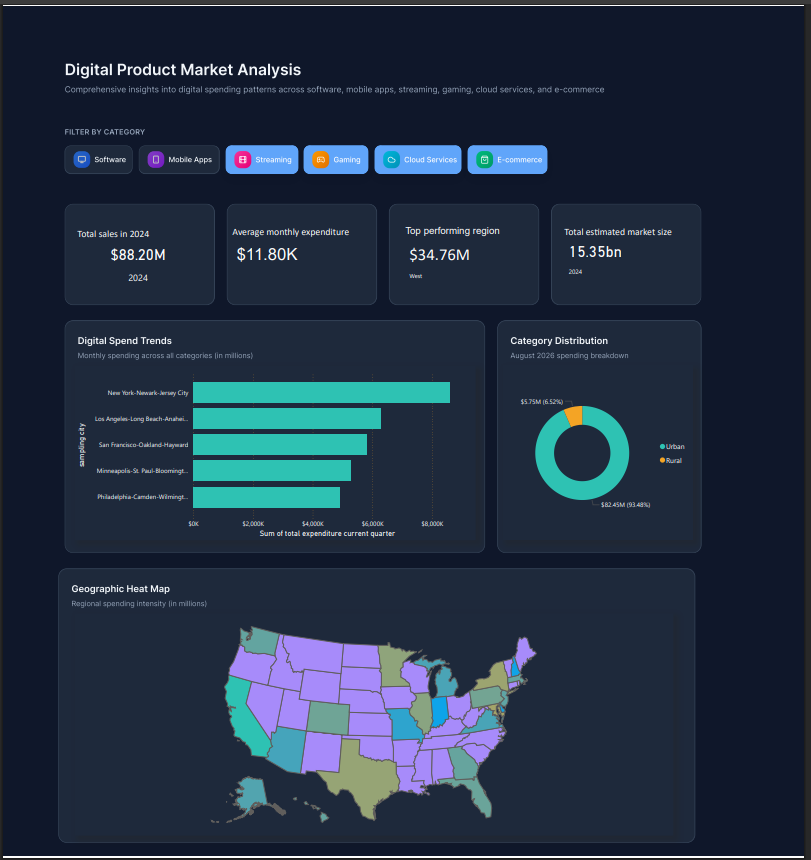
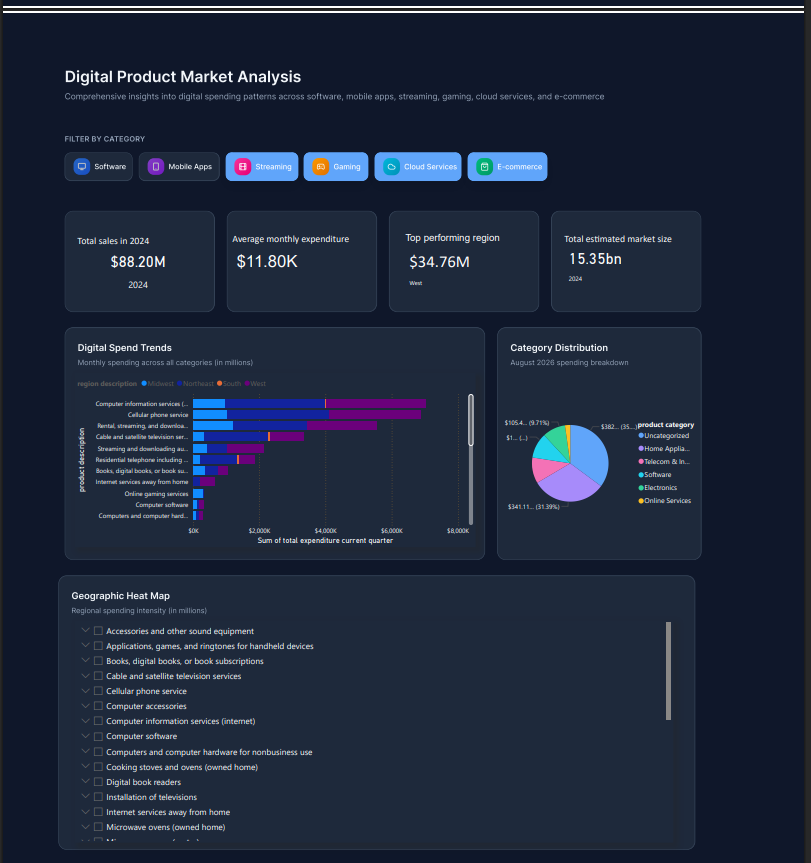
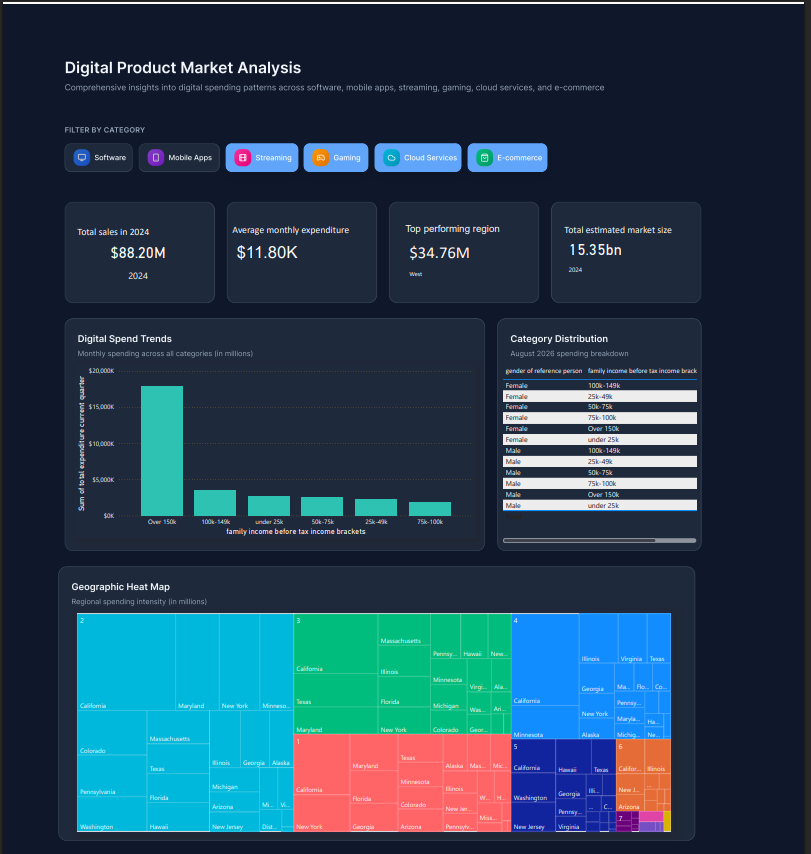

<!--
README (Hybrid Findings Report + GitHub)
Digital Product Insights (US) — Version 1.0 | Date: February 24, 2026
-->

# 🚀 Digital Product Insights: End-to-End US Consumer Analytics

**Quantifying the Digital Revolution through Real-World Economic Indicators**

## 📋 Executive Summary

This project delivers a portfolio-grade, end-to-end analytics pipeline and decision-ready insights for **digital product demand across the United States**. Using **BLS Consumer Expenditure Survey (CE) Public-Use Microdata (PUMD)**, the analysis moves beyond “toy datasets” and quantifies **digital spend (services + devices)**, ranks markets (Region × population-size proxy), tracks trends (nominal + inflation-adjusted), segments customers, and produces forecasts with risk signals.

**Outputs**

- Reproducible **ETL**
- SQL **analytics + KPI tables**
- Python **EDA + modeling notebooks**
- Executive **Power BI dashboard** and slide-deck style narrative :contentReference[oaicite:1]{index=1}

---

## 📑 Table of Contents

1. [🔍 Introduction](#-introduction)
2. [⚙️ Methodology & Architecture](#️-methodology--architecture)
3. [📊 Key Findings & Results](#-key-findings--results)
4. [🤖 Predictive Modeling](#-predictive-modeling)
5. [🖥️ Interactive Dashboard](#️-interactive-dashboard)
6. [✅ Conclusion](#-conclusion)
7. [📁 Appendix: Repo Structure](#-appendix-repo-structure)

---

## 🔍 Introduction

### The Problem

Digital product businesses—electronics, software, and online services—need to understand:

- **Where demand is strongest**
- **How it changes over time** (and under inflation pressure)
- **Which customer segments drive growth**
- **How to plan for future demand** :contentReference[oaicite:2]{index=2}

### The Objective

This project identifies **geographic hotspots**, profiles **high-value customer personas**, and measures **income-to-spend sensitivity (elasticity)** to support executive decision-making.

> **Why this matters:** This work uses real-world BLS microdata and survey weights (calibration weights), proving capability in messy economic datasets and population-representative estimation.

---

## ⚙️ Methodology & Architecture

The project follows a **Bronze → Silver → Gold** architecture to create a reliable “single source of truth” for KPIs.

### 🧱 Data Architecture (Bronze → Silver → Gold)

**Bronze (Raw)**

- Store original ZIP/CSVs under `data/raw/` unchanged
- Keep a run log (source version, date, row counts)

**Silver (Staging in SQL)**

- Load selected household fields into `raw_fmli_*`
- Load selected expenditure rows into `raw_expn_*`
- Build `dim_ucc_digital` (UCC → digital / non-digital + service / device)

**Gold (Analytics Tables)**

- `fact_digital_spend`: household-period-UCC spend + labels + geography
- `dim_household`: household attributes for segmentation
- `kpi_market_period`: KPIs at (Region, POPSIZE, time)
- `kpi_household_period`: KPIs at (NEWID, time) :contentReference[oaicite:5]{index=5}

---

## 🧰 Tech Stack

- **ETL:** Python scripts for ingestion, cleaning, and SQL loading
- **SQL Analytics:** Materialized “Gold” tables (facts, dimensions, KPI layer)
- **Analysis:** Python/Jupyter for EDA + statistical testing (ANOVA / T-Tests where appropriate)
- **Visualization:** 4-page **Power BI** dashboard built for executive storytelling

---

## 📊 Key Findings & Results

The analysis is structured around **three business pillars** to keep results decision-ready.

| Pillar                        | Focus                                  | Key Metric                                    |
| ----------------------------- | -------------------------------------- | --------------------------------------------- |
| **I. Geographic Opportunity** | Market identification & prioritization | **Total Weighted Spend** by market            |
| **II. Consumer Behavior**     | Segmentation & profiling               | **Avg Spend** by income bracket & family size |
| **III. Predictive Insights**  | Trend + sensitivity analysis           | **Income-to-Spend Elasticity** signals        |

### 🎯 Critical KPIs (Survey-Weighted)

- **Total Digital Spend (USD):** `SUM(spend * calibration_weight)`
- **Digital Spend per Household:** `SUM(spend * weight) / SUM(weight)`
- **Digital Spend Growth (Nominal + Real):** period-over-period change
- **Real Digital Spend:** inflation-adjusted using CPI (optional enrichment)
- **Digital Mix Share:** services share vs devices share
- **High-Spender Share:** % households above threshold (e.g., top 20%)
- **Market Opportunity Score:** composite (level + real growth + stability + high-spender share)
- **Market Stability / Volatility:** e.g., coefficient of variation across periods :contentReference[oaicite:7]{index=7}

> 📌 **Note on geography:** Public-use microdata is confidentiality-protected. Market reporting defaults to **Region × POPSIZE × time** to avoid over-claiming city-level precision.

---

## 🤖 Predictive Modeling

To move from “what happened” → “what will happen,” the project includes two models.

1. **Model A: Segmentation (Clustering)**
   - Groups households (or markets) by digital spend mix + features
   - Outputs: **segment labels, personas, distribution by market**
   - Evaluation: silhouette score, stability across periods, interpretability via profiles

2. **Model B: Forecasting (Time-Series)**
   - Forecast **real digital spend per household** by market (Region × POPSIZE)
   - Baselines: **ETS or ARIMA**
   - Evaluation: rolling backtests, MAE/RMSE, prediction intervals for planning.

---

## 🖥️ Interactive Dashboard

Designed for **CEO / Marketing Lead / Product Lead** with thematic storytelling (not random charts).

### Page 1 — Executive Market Overview (Geographic)

- KPI cards: weighted market size, spend/HH, top region
- Map: bubble map or choropleth by spend intensity
- Ranking: top markets
- Split: urban vs rural share

### Page 2 — Consumer Profile & Demographic Deep-Dive

- Spend by income bracket
- Gender × population bucket heatmap
- Spend by number of earners (treemap)

### Page 3 — Product Performance & Category Insights

- Spend by region × product category
- Gift vs personal consumption
- Cost distribution (price points)

### Page 4 — Economic Dynamics (Advanced)

- Income vs spend scatter + trend line (elasticity signal)
- Quarterly variance waterfall (prior vs current quarter)
- Seasonality trends
- Key Influencers visual (Power BI AI tool)

---

## ✅ Conclusion

This project converts confidentiality-protected survey microdata into a strategic asset. Through a robust ETL pipeline and KPI framework, it enables analysts and decision-makers to identify:

- **where** digital growth is happening,
- **who** is driving it,
- and **how** sensitive demand is to economic changes.

It’s designed to demonstrate real-world analyst/data science skills: **data modeling, weighted estimation, KPI design, statistical testing, segmentation, forecasting, and executive storytelling**.

---
